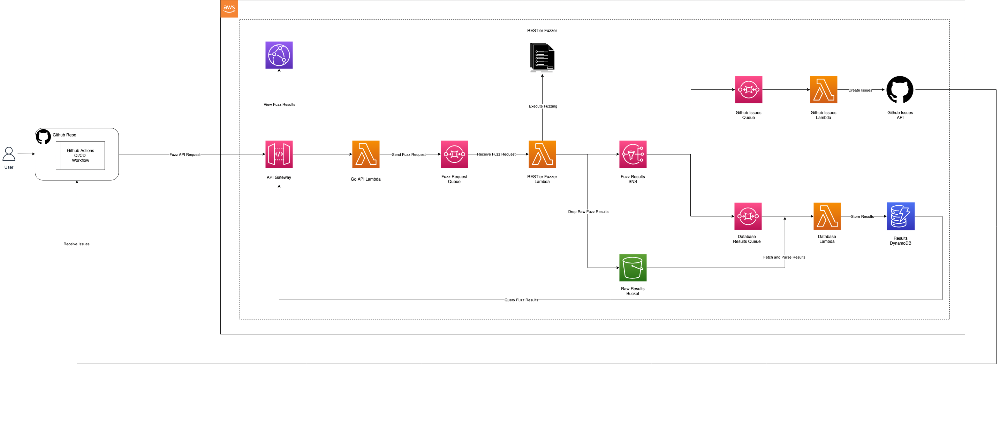

# Golang Lambda React Template

The Golang Lambda React Template is a web application which deploys a golang API to AWS lambda
and a React frontend to AWS CloudFront / S3.

## Architecture Diagram


## Install

Dependencies:
- golang compiler
- node
- npm
- docker
- terraform

Install code dependencies
```
go mod download
cd frontend
npm ci
```

## Build

Compile the backend into the `bin` directory
```
make
```

Compile the frontend into the `frontend/build` directory
```
cd frontend
npm run build
```

## Run

Usage:
```
./bin/main --help
Usage of ./bin/main:
  -gendocs
    	Generate API Docs
  -hostdocs
    	Host API Docs
  -http
    	Run an HTTP server instead of in AWS Lambda
  -loglevel string
    	Log level (default "info")
```

Run backend http server
```
./bin/main -http
```

Run frontend development server
```
cd frontend
npm start
```

## Deploy

Deploys the frontend and backend to AWS cloudfront and lambda
```
cd terraform
terraform init
terraform apply
```

Github pipelines will deploy when the master and production branches are updated

## Test

```
make test # without coverage
make cov  # with coverage
```

## Lint

Run the backend linter\
Runs the golangci-lint docker image with the following tools:
- gofmt
- stylecheck
- gosec
```
make lint
```

Run the frontend linter
```
cd frontend
npm run lint
npm run fix # auto fixes problems
```

## Test Restler
```
sudo docker-compose up -d
curl --location --request POST 'http://localhost:9000/2015-03-31/functions/function/invocations' \
--header 'Content-Type: application/json' \
--data-raw '{"swagger_file":{
    "openapi": "3.0.2",
    "info": {
        "title": "Demo Blog Server",
        "version": "0.1.0"
    },
    "servers": [
        {
            "url": "http://demo_server:8888",
            "description": "Staging environment"
        }
    ],
    "paths": {
        "/api/blog/posts": {
            "get": {
                "summary": "Get Posts",
                "operationId": "get_posts_api_blog_posts_get",
                "parameters": [
                    {
                        "required": false,
                        "schema": {
                            "title": "Page",
                            "type": "integer",
                            "default": 10
                        },
                        "name": "page",
                        "in": "query"
                    },
                    {
                        "required": false,
                        "schema": {
                            "title": "Per Page",
                            "type": "integer",
                            "default": 5
                        },
                        "name": "per_page",
                        "in": "query"
                    }
                ],
                "responses": {
                    "200": {
                        "description": "Successful Response",
                        "content": {
                            "application/json": {
                                "schema": {
                                    "$ref": "#/components/schemas/PageOfResults"
                                }
                            }
                        }
                    },
                    "422": {
                        "description": "Validation Error",
                        "content": {
                            "application/json": {
                                "schema": {
                                    "$ref": "#/components/schemas/HTTPValidationError"
                                }
                            }
                        }
                    }
                }
            },
            "post": {
                "summary": "Create Post",
                "operationId": "create_post_api_blog_posts_post",
                "requestBody": {
                    "content": {
                        "application/json": {
                            "schema": {
                                "$ref": "#/components/schemas/BlogPostPublicInput"
                            }
                        }
                    },
                    "required": true
                },
                "responses": {
                    "201": {
                        "description": "Successful Response",
                        "content": {
                            "application/json": {
                                "schema": {
                                    "$ref": "#/components/schemas/BlogPostPublicInput"
                                }
                            }
                        }
                    },
                    "422": {
                        "description": "Validation Error",
                        "content": {
                            "application/json": {
                                "schema": {
                                    "$ref": "#/components/schemas/HTTPValidationError"
                                }
                            }
                        }
                    }
                }
            }
        },
        "/api/blog/posts/{postId}": {
            "get": {
                "summary": "Get Blog Post",
                "operationId": "get_blog_post_api_blog_posts__postId__get",
                "parameters": [
                    {
                        "required": true,
                        "schema": {
                            "title": "Postid",
                            "type": "integer"
                        },
                        "name": "postId",
                        "in": "path"
                    }
                ],
                "responses": {
                    "200": {
                        "description": "Successful Response",
                        "content": {
                            "application/json": {
                                "schema": {
                                    "$ref": "#/components/schemas/BlogPostPublicInput"
                                }
                            }
                        }
                    },
                    "422": {
                        "description": "Validation Error",
                        "content": {
                            "application/json": {
                                "schema": {
                                    "$ref": "#/components/schemas/HTTPValidationError"
                                }
                            }
                        }
                    }
                }
            },
            "put": {
                "summary": "Update Blog Post",
                "operationId": "update_blog_post_api_blog_posts__postId__put",
                "parameters": [
                    {
                        "required": true,
                        "schema": {
                            "title": "Postid",
                            "type": "integer"
                        },
                        "name": "postId",
                        "in": "path"
                    }
                ],
                "requestBody": {
                    "content": {
                        "application/json": {
                            "schema": {
                                "$ref": "#/components/schemas/BlogPostInput"
                            }
                        }
                    },
                    "required": true
                },
                "responses": {
                    "204": {
                        "description": "Successful Response"
                    },
                    "422": {
                        "description": "Validation Error",
                        "content": {
                            "application/json": {
                                "schema": {
                                    "$ref": "#/components/schemas/HTTPValidationError"
                                }
                            }
                        }
                    }
                }
            },
            "delete": {
                "summary": "Delete Blog Post",
                "operationId": "delete_blog_post_api_blog_posts__postId__delete",
                "parameters": [
                    {
                        "required": true,
                        "schema": {
                            "title": "Postid",
                            "type": "integer"
                        },
                        "name": "postId",
                        "in": "path"
                    }
                ],
                "responses": {
                    "204": {
                        "description": "Successful Response"
                    },
                    "422": {
                        "description": "Validation Error",
                        "content": {
                            "application/json": {
                                "schema": {
                                    "$ref": "#/components/schemas/HTTPValidationError"
                                }
                            }
                        }
                    }
                }
            }
        },
        "/api/doc": {
            "get": {
                "summary": "Root",
                "operationId": "root_api_doc_get",
                "responses": {
                    "200": {
                        "description": "Successful Response",
                        "content": {
                            "application/json": {
                                "schema": {}
                            }
                        }
                    }
                }
            }
        }
    },
    "components": {
        "schemas": {
            "BlogPostInput": {
                "title": "BlogPostInput",
                "required": [
                    "body"
                ],
                "type": "object",
                "properties": {
                    "id": {
                        "title": "Id",
                        "type": "integer"
                    },
                    "body": {
                        "title": "Body",
                        "type": "string"
                    },
                    "checksum": {
                        "title": "Checksum",
                        "type": "string"
                    }
                },
                "example": {
                    "id": 22,
                    "body": "my first blog post",
                    "checksum": "abcde"
                }
            },
            "BlogPostPublicInput": {
                "title": "BlogPostPublicInput",
                "required": [
                    "id",
                    "body"
                ],
                "type": "object",
                "properties": {
                    "id": {
                        "title": "Id",
                        "type": "integer"
                    },
                    "body": {
                        "title": "Body",
                        "type": "string"
                    }
                },
                "example": {
                    "id": 99,
                    "body": "my first blog post"
                }
            },
            "HTTPValidationError": {
                "title": "HTTPValidationError",
                "type": "object",
                "properties": {
                    "detail": {
                        "title": "Detail",
                        "type": "array",
                        "items": {
                            "$ref": "#/components/schemas/ValidationError"
                        }
                    }
                }
            },
            "PageOfResults": {
                "title": "PageOfResults",
                "required": [
                    "items",
                    "per_page",
                    "page",
                    "total"
                ],
                "type": "object",
                "properties": {
                    "items": {
                        "title": "Items",
                        "type": "array",
                        "items": {
                            "$ref": "#/components/schemas/BlogPostInput"
                        }
                    },
                    "per_page": {
                        "title": "Per Page",
                        "type": "integer"
                    },
                    "page": {
                        "title": "Page",
                        "type": "integer"
                    },
                    "total": {
                        "title": "Total",
                        "type": "integer"
                    }
                }
            },
            "ValidationError": {
                "title": "ValidationError",
                "required": [
                    "loc",
                    "msg",
                    "type"
                ],
                "type": "object",
                "properties": {
                    "loc": {
                        "title": "Location",
                        "type": "array",
                        "items": {
                            "anyOf": [
                                {
                                    "type": "string"
                                },
                                {
                                    "type": "integer"
                                }
                            ]
                        }
                    },
                    "msg": {
                        "title": "Message",
                        "type": "string"
                    },
                    "type": {
                        "title": "Error Type",
                        "type": "string"
                    }
                }
            }
        }
    }
}}'

```