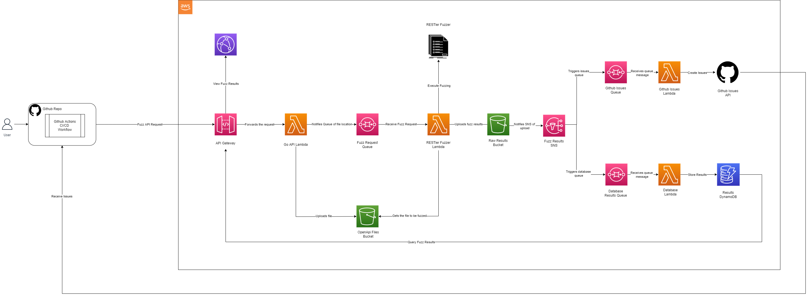

# Dyno

## What is Dyno?

Dyno is a general purpose dynamic analysis tool for your API's. It enables developers to configure dynamic analysis testing with ease by just providing our tool with an OpenAPI file. This then runs and sends back valuable information on the bugs found in a easy to read format. A reason to use Dyno instead of other tools is its low cost, simplicity and fast ability to dynamically test your API. Dynamic analysis testing is valuable to developers as it finds the defects within your API compared to traditional methods where developers try to prevent already known issues. Hence, Dyno provides another layer of security and provides general automated red teaming services. 

Currently Dyno supports the fuzzing of API's through the use of [Microsoft RESTler](https://github.com/microsoft/restler-fuzzer) and RESTful API's that follow and contain an [OpenAPI](https://swagger.io/specification/) specification. Dyno allows a user to integrate their workflow through GitHub actions and through the manual [CLI tool](./cmd/cli/README.md) creating [GitHub Issues](./cmd/issues/README.md) that are sent back to the users own repository. 

## Architecture Diagram


## Documentation of Features 
- [CLI Tool](./cmd/cli/README.md)
- [Restler](./terraform/README.md)
- [Issues](./cmd/issues/README.md)
- [Web App](./frontend/README.md)
- [AWS](./terraform/README.md)


## Setting Up Dyno for Deployment 
### Github Actions and Terraform deployment

Dyno supports being deployed with terraform via github actions.
The github workflows are expecting the following action secrets
| Action Secret                            | Its Use                                                                          |
|------------------------------------------|----------------------------------------------------------------------------------|
| AWS_ACCESS_KEY_ID                        | The ID of the AWS User that allows Github to deploy into AWS                     |
| AWS_SECRET_ACCESS_KEY                    | The corresponding ID of secret access key that allows Github to deploy into AWS  |
| AWS_DEFAULT_REGION                       | The default AWS region to be used by terraform                                   |
| TERRAFORM_LOCK_DYNAMODB_TABLE            | The DynamoDB table which host the lock file for terraform deployment             |
| TERRAFORM_LOCK_DYNAMODB_TABLE_DEMOSERVER | The DynamoDB table which host the lock file for terraform demo server deployment |
| TERRAFORM_STATE_S3_BUCKET                | The s3 bucket which has the state file for both the demo server and Dyno         | 

The deployment requires the following.
- An IAM user with broad privileges to allow creation of resources
- An empty s3 bucket which will host the Terraform state files
- A DynamoDB table which host the lock file for terraform deployment
- A DynamoDB table which host the lock file for terraform demo server deployment

To avoid a circular dependencies on the first deployment of Dyno with terraform 
  - The module terraform/ecr must be deployed first
  - The resources must be transferred to the root terraform state
  - This will have to be done before the github action workflow can be started as a docker container is needed to be deployed into an Elastic Container Registry
  - Instructions are in the terraform/README.md  

### Test Restler Backend
```
sudo docker-compose up -d
curl --location --request POST 'http://localhost:9000/2015-03-31/functions/function/invocations' \
--header 'Content-Type: application/json' --data '@tests/restler_local_test.json'

```

## Setting Up Dyno for Development 
### Install

Dependencies:
- golang compiler
- node
- npm
- docker
- terraform

Install code dependencies
```
go mod download
cd frontend
npm ci
```

### Build

Compile the backend into the `bin` directory
```
make
```

Compile the frontend into the `frontend/build` directory
```
cd frontend
npm run build
```

### Run

Usage:
```
./bin/api/main --help
Usage of ./bin/main:
  -gendocs
    	Generate API Docs
  -hostdocs
    	Host API Docs
  -http
    	Run an HTTP server instead of in AWS Lambda
  -loglevel string
    	Log level (default "info")
```

Run backend http server
```
./bin/api/main -http
```

Run frontend development server
```
cd frontend
npm start
```

### Deploy

Deploys the frontend and backend to AWS cloudfront and lambda
```
cd terraform
terraform init
terraform apply
```

Github pipelines will deploy when the master and production branches are updated

### Test

```
make test # without coverage
make cov  # with coverage
```

### Lint

Run the backend linter\
Runs the golangci-lint docker image with the following tools:
- gofmt
- stylecheck
- gosec
```
make lint
```

Run the frontend linter
```
cd frontend
npm run lint
npm run fix # auto fixes problems
```