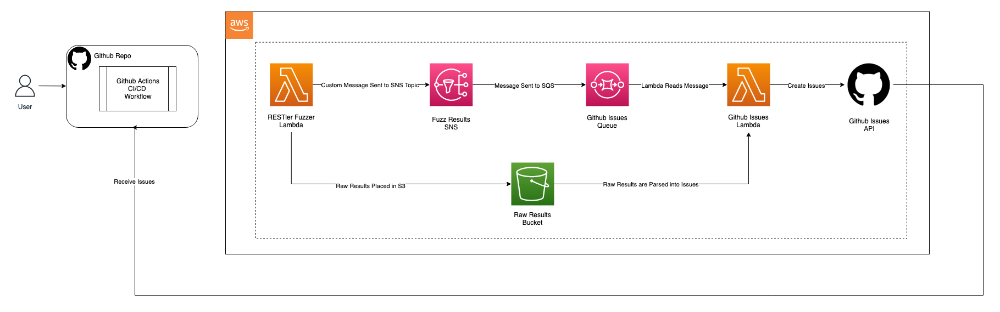

# Issues 

## Purpose of Creating Issues 

The Purpose of creating issues is to allow developers to gain fast insights into understanding problems within their web API's. This is achieved through the parsing of dynamic analysis testing files and presenting them to developers after runtime. These raw results are turned into readiable messages with tags identifying the severity of the bug, who is assigned to fixing the bug and how to potentially fix the bug. This gives developers the ability to quickly understand how to fix issues within their pipeline quickly and securely. 


## Issues AWS Architecture in DYNO

1. An SQS Message is passed to the Lambda from an SNS Queue with details on the location of raw fuzzing results that are created by dynamic analysis tools 
   - Message Structure 

    ```
    {
      "location" : "location", 
      "bucketName": "bucketName",  
      "uuid": "uuid",  
      "token": "token", 
      "owner": "owner", 
      "repo": "repo"
    }
    ```

2. The lambda then executes parsing of the raw results into readable results that are then created into issues that can be used for collaborative platforms. The parsing library used to parse raw results can be found [here](../../internal/parse/README.md) and the structure of issues can be found [here](../../internal/issue/README.md).

3. The lambda then executes an API call to the specified collaborative platform that will be created within the clients specified workflow that could include Github, Jira, GitLab e.t.c. The API calls to collborative tools like Github can be found [here](../../internal/platform/README.md). 

## Issues Architecture Diagram


